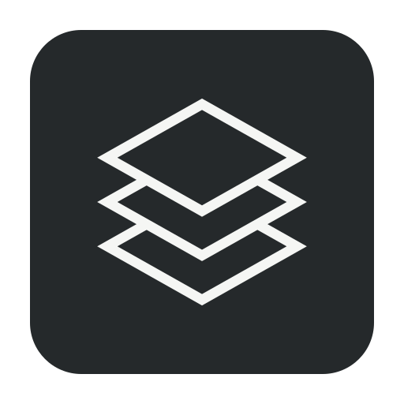

# pile

<p align="center">
  
</p>

pile is a scratchpad editor for notes that may never become files.
It saves your session in the background and restores it when you reopen the app.

The primary workflow does not require projects, filenames, or save dialogs.

## Features

- keeps many scratch buffers open;
- restores sessions after normal exits and crashes;
- searches across open and closed buffers;
- supports multiple cursors, line operations, and undo/redo;
- highlights prose, code, and mixed-language notes;
- imports and exports files when required.

Session data is written automatically in the background.

pile is not an IDE. It has no projects, LSP, terminal, debugger, plugin system,
or workspace setup.

## Install

Download a release from [GitHub Releases](https://github.com/nikaspran/pile/releases).

Releases contain:

- macOS `.app` archives for Intel and Apple silicon;
- a Windows portable zip;
- a Linux tarball;
- a Linux Debian package;
- checksums and an update manifest.

macOS downloads contain `pile.app`. Windows downloads contain `pile.exe`.

## Build from source

Requirements:

- Rust 1.88 or newer;
- the GUI development packages required by `eframe` on Linux.

```sh
git clone https://github.com/nikaspran/pile.git
cd pile
cargo build --locked --release
./target/release/pile
```

To create a local package after the build:

```sh
# macOS
scripts/package-macos.sh

# Linux
scripts/package-linux.sh
```

On Windows, run `./scripts/package-windows.ps1` in PowerShell.

To regenerate the committed platform icons from the SVG source:

```sh
scripts/generate-icons.sh
```

This requires ImageMagick. On macOS, `sips` generates the `.icns` asset.

For development:

```sh
cargo fmt --check
cargo clippy --locked --all-targets
cargo test --locked
```

## Command line

Running `pile` starts the app.

These read the last saved session:

```sh
pile list
pile search "query"
pile get <document-id>
```

Use `--format human` for readable output. Use `--session <path>` to read a
specific session file.

`pile list --closed` includes closed notes.

`pile search` accepts `--closed`, `--case-sensitive`, `--whole-word`, and
`--regex`. Use `--limit` and `--context` to keep the output small.

`pile get` accepts `--closed` and `--lines 10:25`.

## Data and recovery

pile stores the session in the platform data directory.

Saved:

- note text;
- open and closed notes;
- tab order and active panes;
- selections, scroll positions, and bookmarks;
- a limited undo and redo history.

Not saved:

- clipboard contents;
- command palette and search UI state;
- in-flight typing groups.

Session writes happen in the background. The app uses atomic replacement and
keeps backups. If the main session is damaged, pile tries a backup.

pile does not collect telemetry or send note content.

## Documentation

- [Commands](docs/COMMANDS.md)
- [Architecture](docs/ARCHITECTURE.md)
- [Language detection](docs/LANGUAGE_DETECTION.md)
- [Performance rules](docs/PERFORMANCE_INVARIANTS.md)
- [Boundaries](docs/NON_GOALS.md)
- [Releasing](docs/RELEASING.md)
- [Updates](docs/UPDATES.md)
- [Roadmap](ROADMAP.md)

## Contributing

Keep changes small. Keep the scratchpad boundary clear.

Read [CONTRIBUTING.md](CONTRIBUTING.md) before opening a pull request.

## License

MIT. See [LICENSE](LICENSE).
